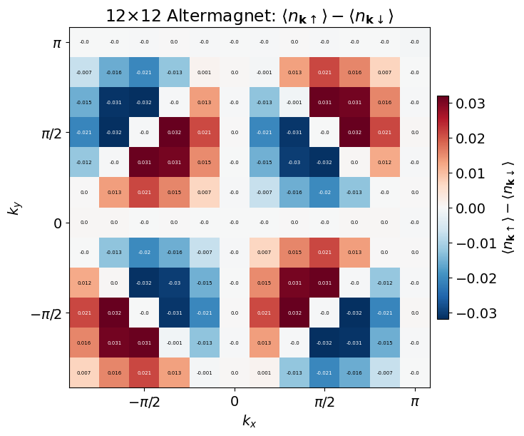

# Altermagnetic Hubbard Model Example

This page covers a $12 \times 12$ altermagnetic Hubbard-model workflow followed by momentum-distribution measurement, following the model setup in [Phys. Rev. Lett. 132, 263402](https://journals.aps.org/prl/abstract/10.1103/PhysRevLett.132.263402). The reusable script remains under `docs/examples/alter/`, but the full commands are expanded below. In this workflow, the optimized ansatz can exhibit spontaneous symmetry breaking, which is visible in spin-resolved observables such as the momentum distribution.

## 12x12 PBC altermagnetic Hubbard model: momentum distribution



The altermagnetic Hubbard-model workflow uses a sublattice- and direction-dependent next-nearest-neighbor hopping. Let $A$ and $B$ denote the two sublattices and let
$\boldsymbol\delta_+=(1,1)$ and $\boldsymbol\delta_-=(1,-1)$. The Hamiltonian is

$$
H_{\mathrm{alter}}
= -t \sum_{\langle i,j\rangle,\sigma} \left(c_{i\sigma}^\dagger c_{j\sigma}+\mathrm{H.c.}\right)
  - \sum_{\mathbf r\in A,\sigma}
  \left(
    t_- c_{\mathbf r\sigma}^\dagger c_{\mathbf r+\boldsymbol\delta_+,\sigma}
    + t_+ c_{\mathbf r\sigma}^\dagger c_{\mathbf r+\boldsymbol\delta_-,\sigma}
    + \mathrm{H.c.}
  \right)
  - \sum_{\mathbf r\in B,\sigma}
  \left(
    t_+ c_{\mathbf r\sigma}^\dagger c_{\mathbf r+\boldsymbol\delta_+,\sigma}
    + t_- c_{\mathbf r\sigma}^\dagger c_{\mathbf r+\boldsymbol\delta_-,\sigma}
    + \mathrm{H.c.}
  \right)
  + U \sum_i n_{i\uparrow}n_{i\downarrow} .
$$

Equivalently, in the $(1,1)$ direction the next-nearest-neighbor hopping element is $t_-$ on the $A$ sublattice and $t_+$ on the $B$ sublattice, while in the $(1,-1)$ direction it is $t_+$ on the $A$ sublattice and $t_-$ on the $B$ sublattice. The runs below use $t_+=0.4$ and $t_-=0$.

After training, the final command measures the fermionic one-body density matrix and momentum distribution,

$$
n_\sigma(\mathbf{k}) = \frac{1}{N_s}\sum_{i,j}
e^{i\mathbf{k}\cdot(\mathbf{r}_i-\mathbf{r}_j)}
\langle c_{i\sigma}^\dagger c_{j\sigma}\rangle .
$$

### Stage 1: determinant pretraining at U=3

```bash
python main.py \
    --output outputs/alter/12_12_N144_U8_pbc/tensor_U3 \
    --L1 12 \
    --L2 12 \
    --particles 144 \
    --U 3 \
    --t2 0.4 \
    --model hubbard_alter \
    --steps 5000 \
    --network_name tensor \
    --boundary1 pbc \
    --boundary2 pbc \
    --save_frequency 5000 \
    --use_x64 \
    --mcmc_step 360 \
    --mode adam \
    --lr 5e-2 \
    --ndet 1 \
    --reduce 500 \
    --seed 100 \
    --batchsize 4096 \
    --fast_update
```

### Stage 2: ACE optimization at U=8

```bash
python main.py \
    --restore outputs/alter/12_12_N144_U8_pbc/tensor_U3 \
    --restore_ndet 1 \
    --output outputs/alter/12_12_N144_U8_pbc/ace \
    --L1 12 \
    --L2 12 \
    --particles 144 \
    --U 8 \
    --t2 0.4 \
    --model hubbard_alter \
    --steps 50000 \
    --network_name ace \
    --boundary1 pbc \
    --boundary2 pbc \
    --save_frequency 5000 \
    --use_x64 \
    --mcmc_step 360 \
    --mode march \
    --norm 1e-1 \
    --lr_start 1000 \
    --lr0 4000 \
    --ndet 1 \
    --hidden 144 \
    --layers 16 \
    --reduce 500 \
    --seed 100 \
    --precision tf32 \
    --batchsize 4096
```

### Stage 3: measure the momentum distribution

```bash
python main.py \
    --output outputs/alter/12_12_N144_U8_pbc/ace \
    --L1 12 \
    --L2 12 \
    --particles 144 \
    --U 8 \
    --t2 0.4 \
    --model hubbard_alter \
    --steps 5000 \
    --network_name ace \
    --boundary1 pbc \
    --boundary2 pbc \
    --use_x64 \
    --mcmc_step 200 \
    --mode test \
    --obs fermi \
    --ndet 1 \
    --hidden 144 \
    --layers 16 \
    --reduce 2000 \
    --seed 100 \
    --precision tf32 \
    --batchsize 4096
```

## References

- [Phys. Rev. Lett. 132, 263402](https://journals.aps.org/prl/abstract/10.1103/PhysRevLett.132.263402) — reference for the altermagnetic Hubbard-model setup.
