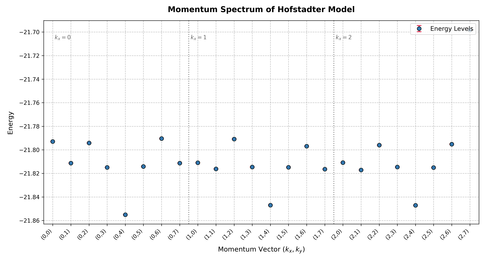
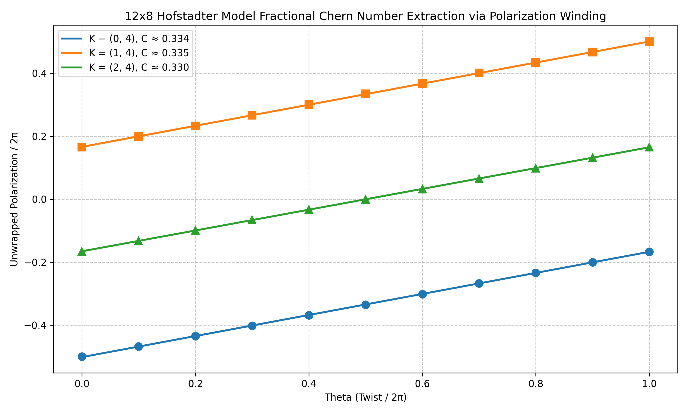

# Hofstadter Model Example

This example studies charge pumping in an interacting Hofstadter model on a torus. The goal is to track the many-body polarization while a flux is inserted through the periodic system, following the workflow in [arXiv:2604.08702](https://arxiv.org/abs/2604.08702).

The reusable script is kept at `docs/examples/hofstadter/12x8_N8_pbc_V2.sh`.

<a id="hofstadter-model-and-charge-pumping"></a>

## Hofstadter Hamiltonian

For simplicity, first consider the Hamiltonian at zero inserted flux, $\theta=0$:

$$
H
= -\sum_{x,y}
\left(
c^\dagger_{x+1,y}c_{x,y}
+ e^{2\pi i\alpha x} c^\dagger_{x,y+1}c_{x,y}
+ \mathrm{H.c.}
\right)
+ V\sum_{\langle i,j\rangle} n_i n_j .
$$

Here $\alpha$ is the magnetic flux density per plaquette and $V$ is the nearest-neighbor density interaction. The example uses a $12\times8$ periodic lattice with $N=8$ polarized particles, $\alpha=0.25$, and $V=2$.

## Charge pumping setup

Charge pumping is measured by adiabatically inserting a flux through the torus and tracking the many-body polarization. In the torus picture, the inserted flux produces a twisted boundary condition along the meridian direction. The induced electric field is along the flux-insertion direction, while the pumped charge flows perpendicular to it.

LaQX measures the $y$-direction Resta polarization,

$$
\hat Z_y
= \exp\left(\frac{2\pi i}{L_y}\sum_{x,y} y\,\hat n_{x,y}\right),
\qquad
P_y(\theta)=\frac{1}{2\pi}\operatorname{Im}\log\langle\hat Z_y\rangle_\theta .
$$

Repeating this measurement as the inserted flux is swept from $\theta=0$ to $\theta=1$ gives the charge-pumping curve. The winding of the polarization curve is the many-body topological response.

## Momentum sectors and selected states

The workflow first scans translation momentum sectors to identify the low-energy manifold. In this example, the momentum spectrum shows three nearly degenerate ground states.



After the three low-energy sectors are identified, each state is followed separately during flux insertion. This gives three polarization curves, one for each member of the nearly degenerate ground-state manifold.

## Charge pumping result

The resulting polarization curves are shown below. Their combined phase winding is used to extract the many-body topological response.



## Workflow commands

The example uses an ACE ansatz in the translation sector $(k_x,k_y)=(0,4)$ on a $12\times8$ periodic lattice. The most important physics flags are `--model hofstadter`, `--dtype complex`, `--V 2`, `--alpha 0.25`, and `--flux_theta`, which controls the inserted flux.

The script stores the shared setup in a Bash array:

```bash
BASE_DIR="outputs/hofstadter/12_8_N8_pbc_V2/ace_small_N3e-1_fresh_kx0_ky4"

COMMON_ARGS=(
    --L1 12
    --L2 8
    --particles 8
    --particles_up 8
    --V 2
    --alpha 0.25
    --model hofstadter
    --dtype complex
    --network_name ace
    --boundary1 pbc
    --boundary2 pbc
    --use_x64
    --mcmc_step 60
    --ndet 1
    --hidden 128
    --layers 12
    --MLP_hidden 128
    --MLP_layers 1
    --seed 0
    --precision tf32
    --polarized
    --batchsize 4096
    --symmetry T
    --kx 0
    --ky 4
)
```

### Train the $\theta=0$ state

The first command optimizes the state at zero inserted flux.

```bash
python main.py \
    --output "${BASE_DIR}" \
    "${COMMON_ARGS[@]}" \
    --flux_theta 0 \
    --steps 5000 \
    --save_frequency 5000 \
    --mode march \
    --norm 3e-1 \
    --lr_start 1000 \
    --lr0 4000 \
    --reduce 100
```

### Measure the $\theta=0$ polarization

The second command evaluates Resta polarization with `--mode test --obs polar`.

```bash
python main.py \
    --output "${BASE_DIR}" \
    "${COMMON_ARGS[@]}" \
    --flux_theta 0 \
    --steps 2000 \
    --mode test \
    --obs polar \
    --reduce 0
```

### Sweep the inserted flux

The flux-threading part copies the previous checkpoint, fine-tunes at the next flux value, and measures polarization again. One step of the sweep, from $\theta=0$ to $\theta=0.1$, is:

```bash
PREV_DIR="${BASE_DIR}"
THETA=0.1
START_STEPS=5000
END_STEPS=6000
CKPT_FILE=$(printf "ckpt_%06d.npz" "${START_STEPS}")
NEW_DIR="${BASE_DIR}_theta${THETA}"

mkdir -p "${NEW_DIR}"
cp "${PREV_DIR}/${CKPT_FILE}" "${NEW_DIR}/${CKPT_FILE}"
cp "${PREV_DIR}/log.csv" "${NEW_DIR}/log.csv"

python main.py \
    --output "${NEW_DIR}" \
    "${COMMON_ARGS[@]}" \
    --flux_theta "${THETA}" \
    --steps "${END_STEPS}" \
    --save_frequency 1000 \
    --mode march \
    --norm 1e-2 \
    --lr_start "${START_STEPS}" \
    --lr0 10000 \
    --reduce 100

python main.py \
    --output "${NEW_DIR}" \
    "${COMMON_ARGS[@]}" \
    --flux_theta "${THETA}" \
    --steps 2000 \
    --mode test \
    --obs polar \
    --reduce 0
```

The script repeats this pattern for $\theta=0.2,\ldots,1.0$. To run the full workflow from the repository root:

```bash
bash docs/examples/hofstadter/12x8_N8_pbc_V2.sh
```

## References

- [arXiv:2604.08702](https://arxiv.org/abs/2604.08702) — reference for the charge-pumping / flux-threading workflow used in this Hofstadter example.
