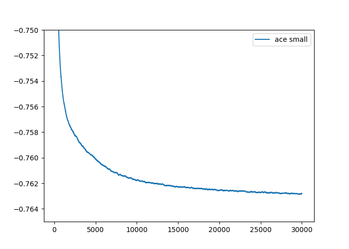
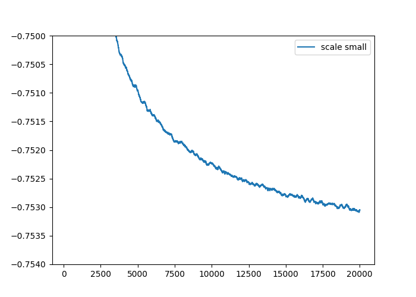

# Hubbard Model Examples

This page expands the Hubbard-model workflows on:

1. a $16 \times 4$ lattice with the ACE ansatz,
2. a $16 \times 8$ lattice with the SCALE ansatz.

The reusable scripts remain under `docs/examples/hubbard/`, and the full commands are expanded below.

## Hubbard Hamiltonian

The workflows target the standard square-lattice Hubbard Hamiltonian

$$
H = -t \sum_{\langle i,j\rangle,\sigma}
    \left(c_{i\sigma}^\dagger c_{j\sigma} + c_{j\sigma}^\dagger c_{i\sigma}\right)
    + U \sum_i n_{i\uparrow} n_{i\downarrow} .
$$

In these examples `--model hubbard` selects this Hamiltonian, `--boundary1 pbc --boundary2 pbc` makes the lattice fully periodic, and `--U 8` sets the target interaction strength for the final VMC relaxation. The optimizer setup follows [arXiv:2507.02644](https://arxiv.org/abs/2507.02644), the ansatz setup follows [arXiv:2604.25775](https://arxiv.org/abs/2604.25775), and the smaller-$U$ determinant warm-start strategy follows [arXiv:2507.10705](https://arxiv.org/abs/2507.10705).

## Experiment workflows

Both final VMC relaxations use periodic boundary conditions in both directions (`--boundary1 pbc --boundary2 pbc`) and optimize the standard Hubbard Hamiltonian at $U=8$. The $16\times8$ workflow uses a weak pinning field only in the determinant warm-start stage; the final SCALE relaxation and the GFMC projection do not include a pinning field.

### 16x4 PBC, U=8: ACE ansatz



This workflow uses a $16\times4$ fully periodic lattice with $N=56$ electrons. Stage 1 trains a one-determinant `tensor` ansatz at $U=4$ with Adam. Stage 2 restores that checkpoint and relaxes an ACE ansatz at $U=8$ with MARCH stochastic reconfiguration. No pinning field is used in either stage.

#### Stage 1: determinant warm start at U=4

```bash
python main.py \
    --output outputs/hubbard/16_4_pbc_U8/tensor_ndet1 \
    --L1 16 \
    --L2 4 \
    --particles 56 \
    --U 4 \
    --model hubbard \
    --steps 5000 \
    --network_name tensor \
    --boundary1 pbc \
    --boundary2 pbc \
    --save_frequency 5000 \
    --use_x64 \
    --mcmc_step 128 \
    --mode adam \
    --lr 5e-2 \
    --ndet 1 \
    --reduce 200 \
    --seed 100 \
    --fast_update \
    --batchsize 4096
```

#### Stage 2: ACE relaxation at U=8

```bash
python main.py \
    --restore outputs/hubbard/16_4_pbc_U8/tensor_ndet1 \
    --restore_ndet 1 \
    --output outputs/hubbard/16_4_pbc_U8/ace_small_N5e-1_fromU4 \
    --L1 16 \
    --L2 4 \
    --particles 56 \
    --U 8 \
    --model hubbard \
    --steps 30000 \
    --network_name ace \
    --boundary1 pbc \
    --boundary2 pbc \
    --save_frequency 2000 \
    --use_x64 \
    --mcmc_step 160 \
    --mode march \
    --norm 5e-1 \
    --lr_start 1000 \
    --lr0 4000 \
    --ndet 1 \
    --hidden 128 \
    --layers 12 \
    --reduce 200 \
    --seed 100 \
    --precision tf32 \
    --batchsize 4096
```

### 16x8 PBC, U=8: SCALE ansatz



This workflow uses a larger $16\times8$ lattice with $N=112$ electrons. Stage 1 trains a one-determinant `tensor` ansatz at $U=4$ with a weak temporary pinning field. This pinning field is only used to prepare a useful warm-start checkpoint. Stage 2 restores the checkpoint and relaxes the standard $U=8$ Hubbard model with the `scale` ansatz, with no pinning field. Stage 3 starts from the final SCALE checkpoint and applies GFMC projection to the same fully periodic $U=8$ Hamiltonian.

#### Stage 1: pinned determinant warm start at U=4

The temporary field is selected by `--hm 0.05 --htype vert_spin_hole --lambda_h 8`. These flags appear only in this warm-start command.

```bash
python main.py \
    --output outputs/hubbard/16_8_pbc_U8/tensor_stripe_U4 \
    --L1 16 \
    --L2 8 \
    --particles 112 \
    --U 4 \
    --hm 0.05 \
    --htype vert_spin_hole \
    --lambda_h 8 \
    --model hubbard \
    --steps 5000 \
    --network_name tensor \
    --boundary1 pbc \
    --boundary2 pbc \
    --save_frequency 5000 \
    --use_x64 \
    --mcmc_step 256 \
    --mode adam \
    --lr 5e-2 \
    --ndet 1 \
    --reduce 500 \
    --seed 100 \
    --fast_update \
    --batchsize 4096
```

#### Stage 2: SCALE relaxation at U=8

The final VMC relaxation removes the temporary pinning field: there is no `--hm`, `--htype`, or `--lambda_h` in this command.

```bash
python main.py \
    --restore outputs/hubbard/16_8_pbc_U8/tensor_stripe_U4 \
    --restore_ndet 1 \
    --output outputs/hubbard/16_8_pbc_U8/scale_small_N5e-1_fromU4 \
    --L1 16 \
    --L2 8 \
    --particles 112 \
    --U 8 \
    --model hubbard \
    --steps 20000 \
    --network_name scale \
    --boundary1 pbc \
    --boundary2 pbc \
    --save_frequency 2000 \
    --use_x64 \
    --mcmc_step 320 \
    --mode march \
    --norm 5e-1 \
    --lr_start 1000 \
    --lr0 8000 \
    --ndet 1 \
    --hidden 256 \
    --MLP_hidden 512 \
    --MLP_layers 4 \
    --reduce 500 \
    --seed 100 \
    --fast_update \
    --batchsize 4096
```

#### Stage 3: GFMC projection from the SCALE checkpoint

The GFMC stage reads the latest checkpoint in the Stage 2 output directory and projects the same fully periodic $U=8$ Hubbard Hamiltonian. For this run, the GFMC projection gives an energy of $-0.75628(2)$.

```bash
python main.py \
    --output outputs/hubbard/16_8_pbc_U8/scale_small_N5e-1_fromU4 \
    --L1 16 \
    --L2 8 \
    --particles 112 \
    --U 8 \
    --model hubbard \
    --steps 5000 \
    --network_name scale \
    --boundary1 pbc \
    --boundary2 pbc \
    --use_x64 \
    --mcmc_step 320 \
    --mode gfmc \
    --ndet 1 \
    --hidden 256 \
    --MLP_hidden 512 \
    --MLP_layers 4 \
    --reduce 448 \
    --seed 100 \
    --fast_update \
    --batchsize 4096
```

## References

- [arXiv:2507.02644](https://arxiv.org/abs/2507.02644) — reference for the optimizer setup used by these examples.
- [arXiv:2604.25775](https://arxiv.org/abs/2604.25775) — reference for the ansatz setup used by these examples.
- [arXiv:2507.10705](https://arxiv.org/abs/2507.10705) — reference for the smaller-$U$ warm-start strategy.
