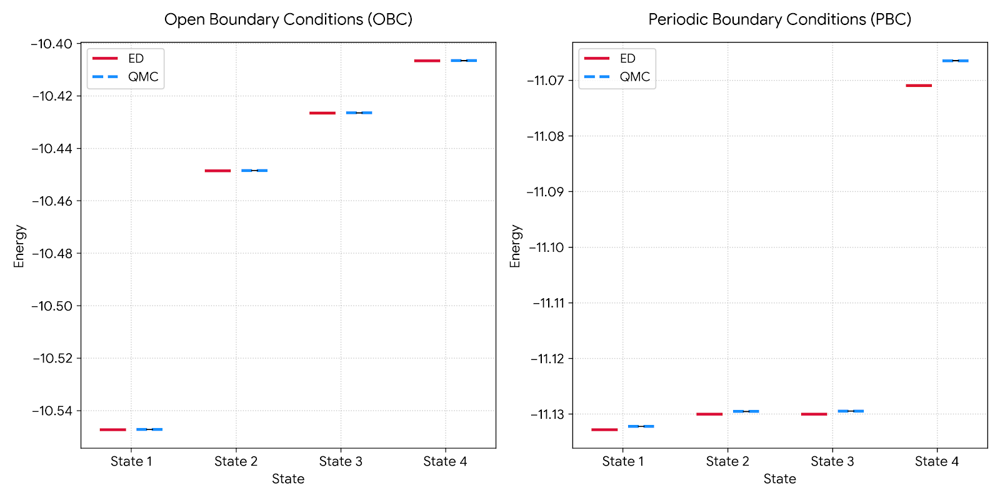

# Excited States with NES

Neural Excited States (NES) optimize several low-lying states in one variational calculation, following the excited-state variational strategy in [Science, doi:10.1126/science.adn0137](https://www.science.org/doi/10.1126/science.adn0137). This page documents the $12\times4$, $N=4$ polarized-particle Hofstadter examples in `docs/examples/nes/hof_12x4_obc.sh` and `docs/examples/nes/hof_12x4_pbc.sh`.

## Physics target

The examples use the same interacting Hofstadter Hamiltonian as the [charge-pumping Hofstadter example](hofstadter.md#hofstadter-model-and-charge-pumping), with $V=2$ and $\alpha=0.25$.

The goal is to calculate the ground-state degeneracy under both open boundary conditions (OBC) and periodic boundary conditions (PBC). The two scripts therefore run the same NES setup on the same lattice and particle sector, changing only the boundary condition:

- `hof_12x4_obc.sh`: open boundaries in both directions,
- `hof_12x4_pbc.sh`: periodic boundaries in both directions.

## NES ansatz

Ground-state VMC optimizes one wavefunction $\psi(x)$. NES instead learns $K$ state functions $\psi_1(x),\ldots,\psi_K(x)$ and applies the variational principle to an expanded antisymmetric wavefunction over $K$ sampled configurations,

$$
\Psi(x_1,\ldots,x_K)
\equiv
\det
\begin{pmatrix}
\psi_1(x_1) & \cdots & \psi_K(x_1) \\
\vdots & \ddots & \vdots \\
\psi_1(x_K) & \cdots & \psi_K(x_K)
\end{pmatrix} .
$$

This construction discourages the learned state functions from collapsing onto the same state. In these examples, `--network_name ace_nes` selects the NES-compatible ACE ansatz, and `--num_states 4` asks LaQX to optimize four low-lying states at once.



## Energy matrix and degeneracy

For optimization, NES only needs the diagonal part of the matrix-valued local-energy estimator. For analyzing the learned states, however, the full matrix is important because it contains the information needed to separate and order the individual low-energy states.

LaQX accumulates the Monte Carlo average of the NES local-energy matrix. Generally speaking, if the learned functions span the correct low-energy subspace but are mixed by a nonsingular matrix $A$, the averaged matrix has the similarity-transformed form

$$
E_{\mathrm{NES}} = A^{-1}\Lambda A,
$$

where $\Lambda$ is the diagonal matrix of eigenenergies. Therefore the individual energies are recovered by diagonalizing the averaged NES energy matrix.

This distinction matters for diagnosing degeneracy. Nearly equal eigenvalues indicate a nearly degenerate low-energy manifold in the chosen boundary condition and variational family.

## Workflow commands

### Open-boundary calculation

This run uses `--boundary1 obc --boundary2 obc`. The first command optimizes the four-state ACE-NES ansatz, and the second command evaluates the matrix-valued energy observable.

```bash
python main.py \
    --output outputs/hofstadter/12_4_N4_obc_V2/ace_small_states4_N3e-1 \
    --L1 12 \
    --L2 4 \
    --particles 4 \
    --particles_up 4 \
    --V 2 \
    --alpha 0.25 \
    --model hofstadter \
    --dtype complex \
    --steps 10000 \
    --network_name ace_nes \
    --num_states 4 \
    --boundary1 obc \
    --boundary2 obc \
    --save_frequency 2000 \
    --use_x64 \
    --mcmc_step 120 \
    --mode march \
    --norm 3e-1 \
    --lr_start 1000 \
    --lr0 4000 \
    --ndet 1 \
    --hidden 128 \
    --layers 12 \
    --MLP_hidden 128 \
    --MLP_layers 1 \
    --reduce 100 \
    --pad 5 \
    --seed 100 \
    --batchsize 4096 \
    --polarized \
    --precision tf32

python main.py \
    --output outputs/hofstadter/12_4_N4_obc_V2/ace_small_states4_N3e-1 \
    --L1 12 \
    --L2 4 \
    --particles 4 \
    --particles_up 4 \
    --V 2 \
    --alpha 0.25 \
    --model hofstadter \
    --dtype complex \
    --steps 5000 \
    --network_name ace_nes \
    --num_states 4 \
    --boundary1 obc \
    --boundary2 obc \
    --use_x64 \
    --mcmc_step 60 \
    --mode test \
    --obs energy \
    --ndet 1 \
    --hidden 128 \
    --layers 12 \
    --MLP_hidden 128 \
    --MLP_layers 1 \
    --reduce 100 \
    --pad 5 \
    --seed 100 \
    --batchsize 4096 \
    --polarized \
    --precision tf32
```

### Periodic-boundary calculation

This run uses `--boundary1 pbc --boundary2 pbc` with the same NES setup.

```bash
python main.py \
    --output outputs/hofstadter/12_4_N4_pbc_V2/ace_small_states4_N3e-1 \
    --L1 12 \
    --L2 4 \
    --particles 4 \
    --particles_up 4 \
    --V 2 \
    --alpha 0.25 \
    --model hofstadter \
    --dtype complex \
    --steps 10000 \
    --network_name ace_nes \
    --num_states 4 \
    --boundary1 pbc \
    --boundary2 pbc \
    --save_frequency 2000 \
    --use_x64 \
    --mcmc_step 120 \
    --mode march \
    --norm 3e-1 \
    --lr_start 1000 \
    --lr0 4000 \
    --ndet 1 \
    --hidden 128 \
    --layers 12 \
    --MLP_hidden 128 \
    --MLP_layers 1 \
    --reduce 100 \
    --pad 5 \
    --seed 100 \
    --batchsize 4096 \
    --polarized \
    --precision tf32

python main.py \
    --output outputs/hofstadter/12_4_N4_pbc_V2/ace_small_states4_N3e-1 \
    --L1 12 \
    --L2 4 \
    --particles 4 \
    --particles_up 4 \
    --V 2 \
    --alpha 0.25 \
    --model hofstadter \
    --dtype complex \
    --steps 5000 \
    --network_name ace_nes \
    --num_states 4 \
    --boundary1 pbc \
    --boundary2 pbc \
    --use_x64 \
    --mcmc_step 60 \
    --mode test \
    --obs energy \
    --ndet 1 \
    --hidden 128 \
    --layers 12 \
    --MLP_hidden 128 \
    --MLP_layers 1 \
    --reduce 100 \
    --pad 5 \
    --seed 100 \
    --batchsize 4096 \
    --polarized \
    --precision tf32
```

The reusable scripts run these commands from the repository root:

```bash
bash docs/examples/nes/hof_12x4_obc.sh
bash docs/examples/nes/hof_12x4_pbc.sh
```

Each script trains an ACE-NES state with four learned components and then evaluates the matrix-valued energy observable. The resulting `energy.npz` stores the sampled mean and variance of this matrix estimator.

## References

- [Science, doi:10.1126/science.adn0137](https://www.science.org/doi/10.1126/science.adn0137) — reference for the neural excited-state method followed by this NES workflow.
