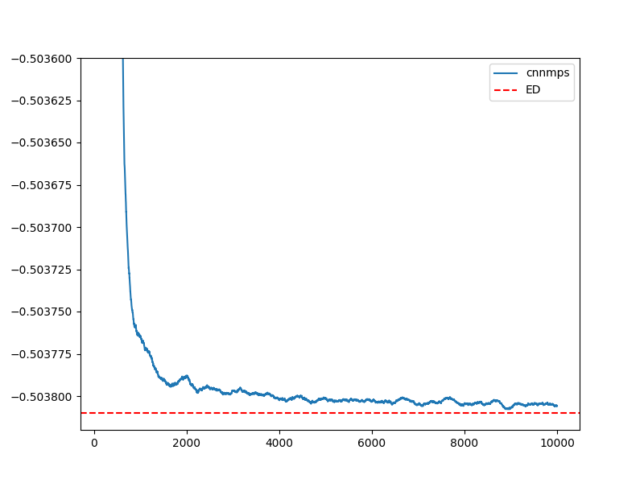

# Spin Model Example

This page expands the $6\times6$ frustrated spin example. The script remains at `docs/examples/spin/6x6_J1J2_cnnmps.sh`, while the explicit command is shown below. The spin-model setup follows [arXiv:2603.14425](https://arxiv.org/abs/2603.14425).

## Hamiltonian

The model is the square-lattice $J_1$-$J_2$ Heisenberg Hamiltonian,

$$
H = J_1 \sum_{\langle i,j\rangle} \mathbf{S}_i\cdot\mathbf{S}_j
  + J_2 \sum_{\langle\langle i,j\rangle\rangle} \mathbf{S}_i\cdot\mathbf{S}_j .
$$

For this example, $J_1=1$ and $J_2=0.5$, a frustrated regime where the ground state is difficult for simple product states. For implementation convenience, LaQX maps the spin degrees of freedom to a polarized-boson representation, enabled by `--use_boson --polarized`, and optimizes a CNN-MPS neural quantum state.

!!! warning "Energy convention"
    The spin Hamiltonian implemented in LaQX is shifted by a constant relative to the conventional $J_1$-$J_2$ Heisenberg Hamiltonian written above. This constant shift does not change the optimized wavefunction, but users should account for it when comparing absolute energies against other codes or literature values.

The command also enables the Marshall sign convention and $D_4$ lattice symmetry.



## Command

```bash
python main.py \
    --output outputs/spin/6_6/cnnmps_D4_H32_L20_MLP64_MPS20_mar_N2e-2_mu0.98 \
    --L1 6 \
    --L2 6 \
    --particles 18 \
    --particles_up 18 \
    --j1 1 \
    --j2 0.5 \
    --model spin \
    --steps 10000 \
    --network_name cnn_mps \
    --boundary1 pbc \
    --boundary2 pbc \
    --save_frequency 2000 \
    --use_x64 \
    --mcmc_step 72 \
    --mode march \
    --norm 2e-2 \
    --mu 0.98 \
    --lr0 4000 \
    --clip_el 10 \
    --hidden 32 \
    --layers 20 \
    --MLP_hidden 64 \
    --MLP_layers 1 \
    --mpsdim 20 \
    --reduce 200 \
    --seed 100 \
    --precision tf32 \
    --batchsize 4096 \
    --marshall \
    --polarized \
    --use_boson \
    --symmetry D4
```

## What to inspect

The output directory contains checkpoints and `log.csv`. The main convergence signals are the sampled energy and variance. For a stable VMC run, the energy should decrease and the local-energy variance

$$
\operatorname{Var}(E_{\mathrm{loc}})
= \langle |E_{\mathrm{loc}}|^2\rangle
- |\langle E_{\mathrm{loc}}\rangle|^2
$$

should generally become smaller as optimization improves.

## References

- [arXiv:2603.14425](https://arxiv.org/abs/2603.14425) — reference for the frustrated-spin workflow and CNN-MPS-style setup used here.
