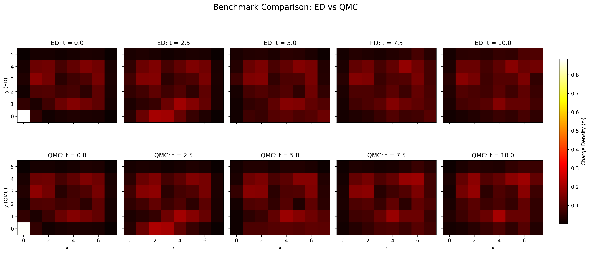
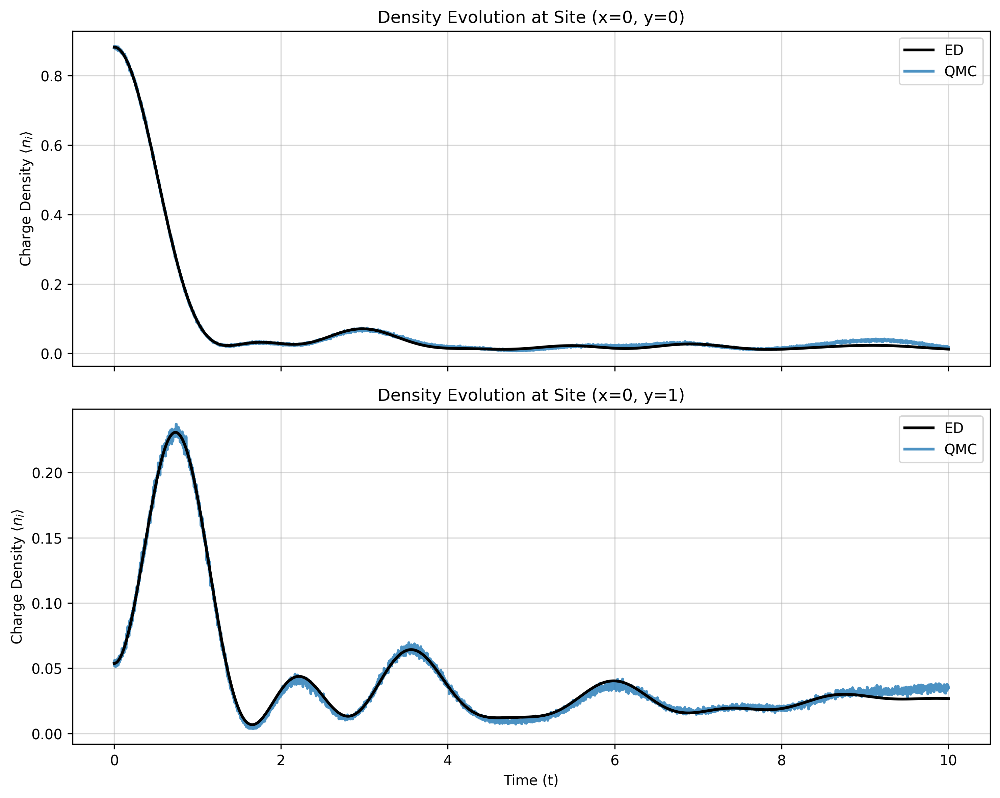

# Time Evolution with tVMC

This page expands the time-dependent VMC example. The script remains at `docs/examples/tvmc/hof_8x6_obc.sh`; the full commands are shown below.

## Physics target

Time-dependent VMC projects dynamics onto the tangent space of the variational manifold. For parameters $\theta(t)$ and wavefunction $|\psi_{\theta(t)}\rangle$, the real-time TDVP update can be written as the least-squares projection

$$
\dot{\theta}
= \operatorname*{arg\,min}_{v}
\left\|
\sum_a v_a |\partial_a\psi_\theta\rangle + \mathrm{i}H|\psi_\theta\rangle
\right\|^2,
$$

which gives the projected linear system $\sum_b S_{ab}\dot{\theta}_b=-\mathrm{i}F_a$. Using the log-derivatives

$$
O_a(x)=\partial_a \log \psi_\theta(x),
$$

the TDVP matrix and force can be written as covariance estimates over Monte Carlo samples:

$$
S_{ab}=\langle O_a^* O_b\rangle-\langle O_a^*\rangle\langle O_b\rangle,
\qquad
F_a=\langle O_a^* E_{\mathrm{loc}}\rangle-\langle O_a^*\rangle\langle E_{\mathrm{loc}}\rangle.
$$

The example first trains an ACE reference state for the Hofstadter model on an $8\times6$ open-boundary lattice. It then restores that checkpoint and uses `ace_peft` for parameter-efficient tVMC evolution. The `ace_peft` wrapper freezes the majority of the restored ACE parameters and evolves only a compact PEFT output block, following the parameter-efficient adaptation strategy in [arXiv:2606.05850](https://arxiv.org/abs/2606.05850). This helps maintain numerical stability during time evolution.

## Hamiltonian

The tVMC example uses the same interacting Hofstadter Hamiltonian as the [charge-pumping Hofstadter example](hofstadter.md#hofstadter-model-and-charge-pumping). During the initial training stage, `--hv -4` adds a site-local pinning potential

$$
H_{\mathrm{pin}} = h_v n_0,
$$

with $h_v=-4$.

The time-evolution stage measures density with `--obs density`, corresponding to observables of the form

$$
\langle n_r(t)\rangle = \langle \psi_{\theta(t)}|n_r|\psi_{\theta(t)}\rangle .
$$





## Stage 1: train the ACE initial state

```bash
python main.py \
    --output outputs/hofstadter/8_6_N4_obc_V2/ace_small2_hv-4_N5e-1 \
    --L1 8 \
    --L2 6 \
    --particles 4 \
    --particles_up 4 \
    --V 2 \
    --alpha 0.25 \
    --hv -4 \
    --model hofstadter \
    --dtype complex \
    --steps 10000 \
    --network_name ace \
    --boundary1 obc \
    --boundary2 obc \
    --save_frequency 2000 \
    --use_x64 \
    --mcmc_step 40 \
    --mode march \
    --norm 5e-1 \
    --lr_start 1000 \
    --lr0 4000 \
    --ndet 1 \
    --hidden 128 \
    --layers 12 \
    --MLP_hidden 256 \
    --MLP_layers 1 \
    --reduce 100 \
    --pad 5 \
    --seed 100 \
    --precision tf32 \
    --batchsize 4096 \
    --polarized
```

## Stage 2: PEFT tVMC evolution

The tVMC command restores the ACE checkpoint, switches to `ace_peft`, performs a burn-in, and integrates the projected equations with the Runge-Kutta Method. Because most ACE parameters are frozen, the TDVP solve acts on a smaller parameter subspace, reducing instability from over-flexible updates.

```bash
python main.py \
    --restore outputs/hofstadter/8_6_N4_obc_V2/ace_small2_hv-4_N5e-1 \
    --output outputs/hofstadter/8_6_N4_obc_V2/ace_small2_peft_tvmc_lr2e-3_rk4_B40960_svd1e-8 \
    --L1 8 \
    --L2 6 \
    --particles 4 \
    --particles_up 4 \
    --V 2 \
    --alpha 0.25 \
    --model hofstadter \
    --dtype complex \
    --steps 5000 \
    --network_name ace_peft \
    --boundary1 obc \
    --boundary2 obc \
    --save_frequency 1000 \
    --use_x64 \
    --mcmc_step 30 \
    --burn_in \
    --drop_step 200 \
    --mode tvmc \
    --lr 2e-3 \
    --integrator rk4 \
    --mu 0 \
    --solver svd \
    --pinv_cutoff 1e-8 \
    --ndet 1 \
    --hidden 128 \
    --layers 12 \
    --MLP_hidden 256 \
    --MLP_layers 1 \
    --reduce 100 \
    --pad 5 \
    --seed 100 \
    --precision tf32 \
    --batchsize 40960 \
    --polarized \
    --obs density
```

## References

- [arXiv:2606.05850](https://arxiv.org/abs/2606.05850) — reference for the `ace_peft` parameter-efficient adaptation used by this tVMC workflow.
